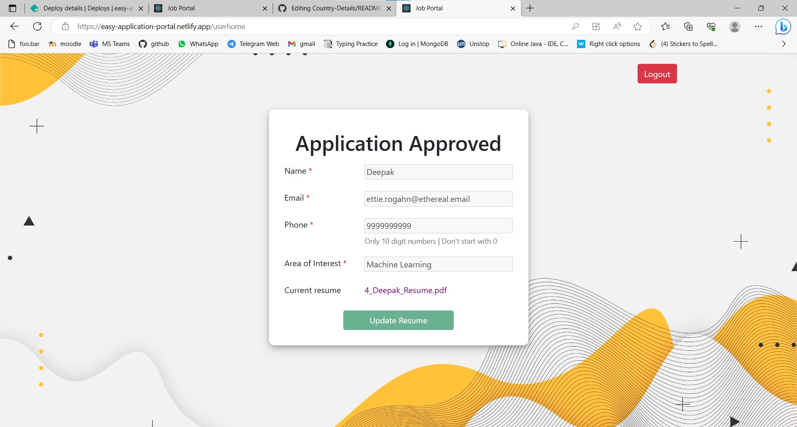
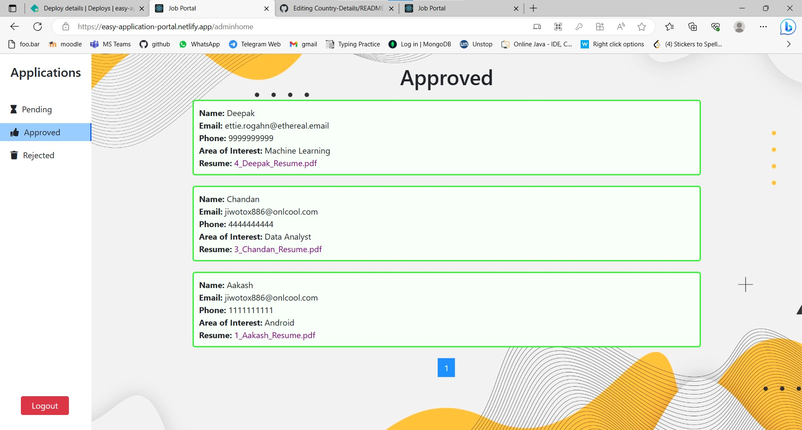

# Application Portal

## Table of contents

- [Overview](#overview)
  - [Admin](#admin)
  - [User](#user)
  - [The challenge](#the-challenge)
  - [Links](#links)
- [My process](#my-process)
  - [Built with](#built-with)
  - [What I learned](#what-i-learned)
  - [Continued development](#continued-development)
  - [Useful resources](#useful-resources)
- [Author](#author)

## Overview
A React app for an job application platfrom.
### Admin

Login on the admin route [https://easy-application-portal.netlify.app/admin](https://easy-application-portal.netlify.app/admin)
username = "admin"
password = "12345"

Note- currently there is only one admin.

### User

Signup and Login on the user route [https://easy-application-portal.netlify.app](https://easy-application-portal.netlify.app)

### The challenge

User should be able to

- Send details through the application form
- Update resume while it is in pending status
- View the apllication status(pending, approved, rejected)
- Receive email updates on the application

Admin should be able to 

- See different category of application (pending, approved, rejected).
- Accept or Reject a pending application.

### Screenshots

### Links

- Frontend Solution URL: [https://github.com/trun0/Application-Portal-Frontend](https://github.com/trun0/Application-Portal-Frontend)
- Backend Solution URL: [https://github.com/trun0/Application-Portal-Backend](https://github.com/trun0/Application-Portal-Backend)
- Live Site URL: [https://easy-application-portal.netlify.app](https://easy-application-portal.netlify.app)

## My process

### Built with

- Semantic HTML5 markup
- CSS custom properties
- [React](https://reactjs.org/) - JS library
- [PostgreSQL](https://www.postgresql.org/) - SQL Database 
- [Nodemailer](https://nodemailer.com/about/) -  Module for Node.js applications to allow easy email sending.

### What I learned

I learned how to send emails through node applications.

### Continued development

I look forward to to learn new concepts of React and make this project better.

### Useful resources

- [Render](https://render.com/) - This helped me to host my server and database.
- [Netlify](https://www.netlify.com/) - This helped me to host my frontend.

## Author

Tarun Kumar

